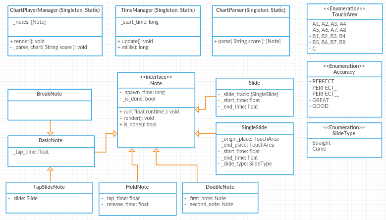
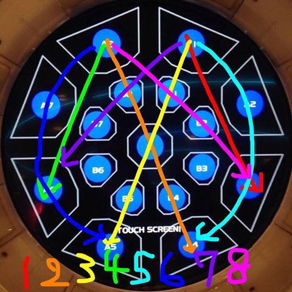

# MaiChartPlayer
Chart player for Maimai (Arcade Game) using Electron.

Project was made for self-learning purposes on building Electron application as well as the basic of developing a rhythm game.

### Class Diagram

This is the initial Class Diagram I made. There could be some missing part somewhere along the **slide note** requirements due to there are some things I am not clear yet.

### Basic Slide Rule
##### Touch Sensor

*Sorry for the ugly picture, I will definitely replace it with something better in the future*

Maimai has some predefined touch areas to handle the sliding course. From my experience, here are some of the rules I have discovered:
1. To Slide the Note, the player must touch the Slide Note **IN SEQUENCE**. For example, a straight slide from A1 to A4 (top right to bottom right) would have the sequence of A1 - (B1 or B2) - (B3 or B4) - A4. Touching A1 then (B1 or B2) after slide has been spawned would reduce the slide line to half; leaving only (B3 or B4) - A4 left.
2. Touching the area where the previous area as not been touched will do nothing. *Except Rule 3*
3. When there are two areas left on the slide, touching the last part would finish the slide instantly (*Needs Confirmation*)

### TO BE DISCOVERED
1. Confirm Slide Rule 3
2. (optional) Find out the time offsets for: PERFECT (and the variances for Break Notes), GREAT, GOOD
3. Slide area sequences for straight. Is the assumption made in Rule 1 correct?

### Wireframes / Lo-fi Prototypes
To be added

### Projected Features
- Standard Maimai Chart Functionalities
- Choose Chart
- Choose Music File
- Input Offset

### TODO Lists
- [ ] Create a Basic Wireframe / UI
- [ ] Implement Chart Data Structure
- [ ] Implement Chart Parser
- [ ] Implement Chart Rendering + Visualizations
